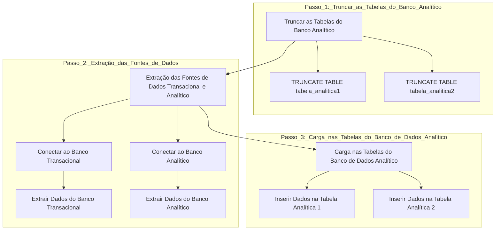

```mermaid
graph TD;
    A[Truncar as Tabelas do Banco Analítico]
    B[Extração das Fontes de Dados Transacional e Analítico]
    C[Carga nas Tabelas do Banco de Dados Analítico]

    subgraph Passo_1:_Truncar_as_Tabelas_do_Banco_Analítico
        A1[TRUNCATE TABLE tabela_analitica1]
        A2[TRUNCATE TABLE tabela_analitica2]
        A --> A1
        A --> A2
    end

    subgraph Passo_2:_Extração_das_Fontes_de_Dados
        B1[Conectar ao Banco Transacional]
        B2[Extrair Dados do Banco Transacional]
        B3[Conectar ao Banco Analítico]
        B4[Extrair Dados do Banco Analítico]
        B --> B1
        B --> B3
        B1 --> B2
        B3 --> B4
    end

    subgraph Passo_3:_Carga_nas_Tabelas_do_Banco_de_Dados_Analítico
        C1[Inserir Dados na Tabela Analítica 1]
        C2[Inserir Dados na Tabela Analítica 2]
        C --> C1
        C --> C2
    end

    A --> B
    B --> C
```