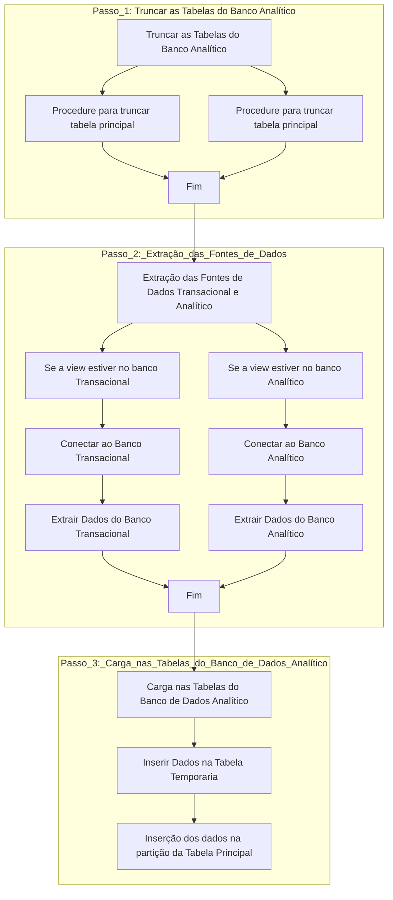

```mermaid
graph TD;
    A[Truncar as Tabelas do Banco Analítico]
    B[Extração das Fontes de Dados Transacional e Analítico]
    C[Carga nas Tabelas do Banco de Dados Analítico]

    subgraph Passo_1: Truncar as Tabelas do Banco Analítico
        A1[Procedure para truncar tabela principal]
        A2[Procedure para truncar tabela principal]
        A3[Fim]
        A --> A1
        A --> A2
        A2 --> A3
        A1 --> A3

    end

    subgraph Passo_2:_Extração_das_Fontes_de_Dados
        B1[Se a view estiver no banco Transacional]
        B2[Se a view estiver no banco Analítico]
        B3[Conectar ao Banco Transacional]
        B4[Extrair Dados do Banco Transacional]
        B5[Conectar ao Banco Analítico]
        B6[Extrair Dados do Banco Analítico]
        B7[Fim]
        B --> B1
        B --> B2
        B1 --> B3
        B2 --> B5
        B3 --> B4
        B5 --> B6
        B4 --> B7
        B6 --> B7

    end

    subgraph Passo_3:_Carga_nas_Tabelas_do_Banco_de_Dados_Analítico
        C1[Inserir Dados na Tabela Temporaria]
        C2[Inserção dos dados na partição da Tabela Principal]

        C --> C1
        C1 --> C2
    end

    A3 --> B
    B7 --> C
```